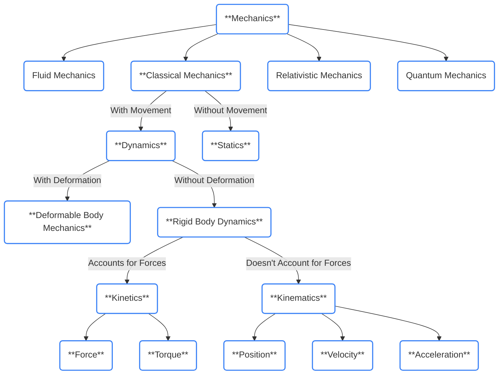





### 1.
**Whole Organism:** Gait analysis of the whole organism  
**System level:** Muscular system and the movement it produces  
**Organ level:** Individual muscle, or perhaps heart or lungs if combinging biomechanics with physiology  
**Tissue level:** Tendon, ligament, or bone tissue  
**Cell level:** Myocytes  
**Cellular subunits level:** Cell wall stress, heel strike hemolysis

### 2.
**Abstract:**
> The present study was conducted to biomechanics data on snowboard riding in order to help the improvement of the performance of the members of the national snowboarding team. Based on the results of this study, the following conclusions can be drawn. In neutral positions, the ‘up’motions were taken in which the heights of the right and left hips were relatively the highest and at the moments of turns in both directions, ‘down’motions were taken in which the heights of the right and left hips were relatively the lowest. During front side turns, the right ankle angle became smaller than the left ankle angle so that the toe edge moved deeper into the snow. Muscle activity during front side turns, the right vastus intermedius muscle, the right biceps femoris muscle, the right gastrocnemius muscle, and the right anterior tibial muscle were shown to be major activated muscles. During backside turns, the right vastus lateralis muscle, the right vastus intermedius muscle, the left biceps femoris muscle, and the right anterior tibial muscle (12.64%) were observed as major activated muscles. Plantar pressure analysis during front side turns, the largest vertical force and plantar pressure acted on the left front food and the right hind foot. During backside turns, the largest vertical force and plantar pressure acted on the left hind foot and the right hind foot. In further studies, the comparison of positions in successive turns is recommended.  

**Citation:** Lee, C.-H., Nam, K., & Back, J. (2016). Biomechanical analysis of snowboard riding motions. International Journal of Bio-Science and Bio-Technology, 8(6), 243–252. https://doi.org/10.14257/ijbsbt.2016.8.6.23  

**How I think this article represents biomechanics being applied:** Biomechanics is the study of mechanics as it relates to living organisms. Mechanics is the study of movements and the forces that caused them. Since this research paper studied the forces produced during snowboarding and their resultant movements, this is an application of biomechanics to the field of snowboarding.

### 3.
- **Mechanics**: motion & forces producing motion
- **Statics**: mechanics without mevement
- **Dynamics**: mechanics with movement
- **Rigid body dynamics**: dynamics with objects that don't deform
- **Deformable body mechanics**: dynamics with objects that deform
- **Kinematics**: motion (without considering forces)
- **Kinetics**: motion with forces
- **Position**: where something is
- **Velocity**: rate of change of position (direnction and magnitude)
- **Acceleration**: rate of change of velocity
- **Force**: Kg x m/s^2
- **Torque**: force x distance from fulcrum



<div style="display:none;">
    ```mermaid 
        graph TD
        %% Main Structure
        mech(**Mechanics:**<br>The Study of Motion and the Forces Which Produce Motion)
        mech --> fm(Fluid Mechanics:<br>The Study of Gases and Liquids in Motion)
        mech --> cm(**Classical Mechanics:**<br>Motion of Macroscopic Objects and the Forces Acting On Them)
        mech --> rm(Relativistic Mechanics:<br>Motion at High Speeds, Close to the Speed of Light)
        mech --> qm(Quantum Mechanics:<br>Behavior of Matter and Energy at Atomic Scales)
        cm -->|With Movement| dyn(**Dynamics:**<br>The Study of Forces and Motion)
        cm -->|Without Movement| stat(**Statics:**<br>Forces and Equilibrium in Stationary Objects)
        dyn -->|With Deformation| dbd(**Deformable Body Mechanics:**<br>Behavior of Objects that Change Shape Under Force)
        dyn -->|Without Deformation| rbd(**Rigid Body Dynamics:**<br>Motion of Objects that Do Not Deform)
        rbd -->|Accounts for Forces| kinet(**Kinetics:**<br>The Study of Forces that Cause Motion)
        rbd -->|Doesn't Account for Forces| kinem(**Kinematics:**<br>The Study of Motion Without Considering Forces)
        kinem --> pos(**Position:**<br>The Location of an Object in Space)
        kinem --> vel(**Velocity:**<br>The Rate of Change of Position with Respect to Time)
        kinem --> acc(**Acceleration:**<br>The Rate of Change of Velocity with Respect to Time)
        kinet --> force(**Force:**<br>An Interaction that Causes a Change in Acceleration)
        kinet --> torque(**Torque:**<br>Rotational Force Acting on an Object)

        %% Tailwind Blue-400/Blue-500 Color Scheme
        style mech fill:none,stroke:#3b82f6,stroke-width:2px
        style fm fill:none,stroke:#3b82f6,stroke-width:2px
        style rm fill:none,stroke:#3b82f6,stroke-width:2px
        style cm fill:none,stroke:#3b82f6,stroke-width:2px
        style qm fill:none,stroke:#3b82f6,stroke-width:2px
        style dyn fill:none,stroke:#3b82f6,stroke-width:2px
        style stat fill:none,stroke:#3b82f6,stroke-width:2px
        style rbd fill:none,stroke:#3b82f6,stroke-width:2px
        style dbd fill:none,stroke:#3b82f6,stroke-width:2px
        style kinet fill:none,stroke:#3b82f6,stroke-width:2px
        style kinem fill:none,stroke:#3b82f6,stroke-width:2px
        style pos fill:none,stroke:#3b82f6,stroke-width:2px
        style vel fill:none,stroke:#3b82f6,stroke-width:2px
        style acc fill:none,stroke:#3b82f6,stroke-width:2px
        style force fill:none,stroke:#3b82f6,stroke-width:2px
        style torque fill:none,stroke:#3b82f6,stroke-width:2px
    ```
</div>