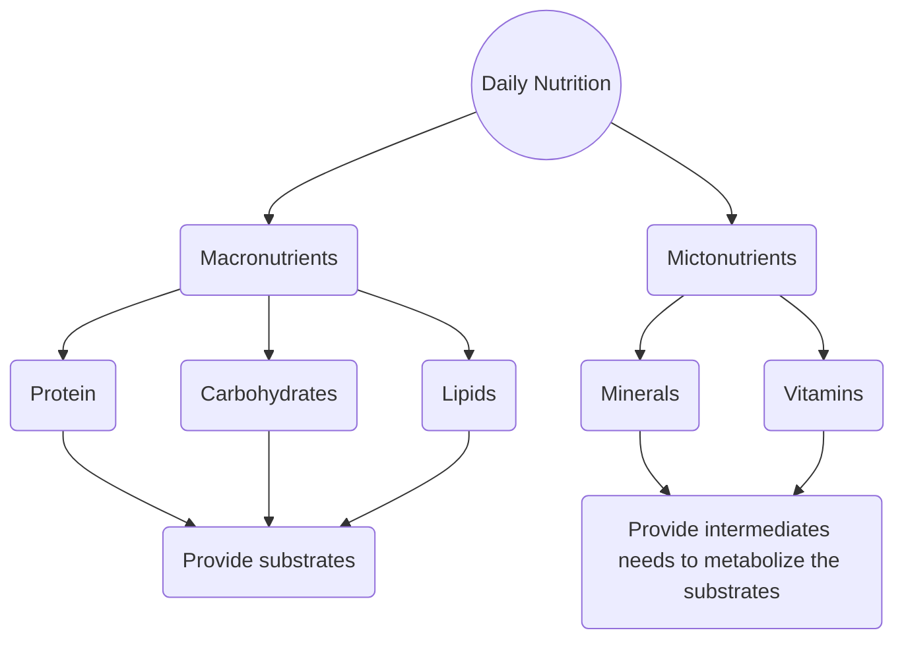

Moving to Chapter 3: Fuel sources for muscle and Exercise Metablolism

**Objectives**
- benefits and limitations of different energy pathways
- how muscles use this energy

## ATP sources

#### Factors influencing which energy systems are used
- Exercise intensity & duration
- Recovery time/status of energy stores before exercise begins
- Level and type of training
- Strength vs. endurance

### PCr

Creatine (Cr) + ATP --> PCr + ADP

### Glycolysis
- anaerobic
- outside mitochondria **will be on quiz?**
- from Glucose:
    - stored glycogen breakdownn (called **glycogenolysis**)
        - pulled from muscles first
        - then from liver
    - taken up from blood
    - synthesized in the body (called **gluconeogenesis**)
        - lactate, glycerol, and alanine (an amino acid) are key metabolites
        - stimulated by:
            - Glucagon: in response to low blood glucose
            - Cortisol: in resonse to "stress", promotes breakdown of protein so that glucogenic amino acis can be used for gluconeogenesis.
- Supply is limited (but much greater than PCr) --- how quickly it is depleted depens on many factors.

Example: leg glucose uptake over time graph
- glucose uptake increases faster a peaks sooner @ 60% VO2 max than at 30% VO2 max

Glycogen stores:
- Muscle: 300g
- Liver: 100g
- Blood Glucose 5 mmol/L

