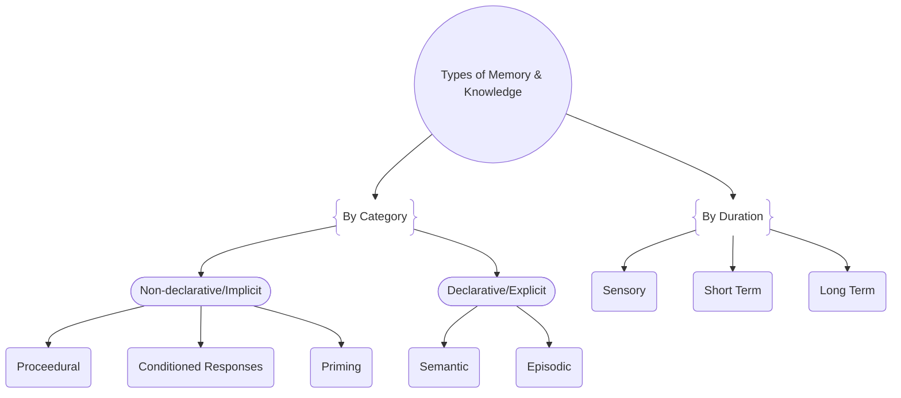

One of my favorite classes was called "Motor Control & Learning". Here, I'll describe key points covered by this course and why their implications are critical to understand when teaching or learning any type of movement.

## What is a motor skill?

A motor skill is a learned, repeatable ability to achive a movement goal under time and/or form-bound criteria. A reflex which was inherent rather than learned is not a motor skill. While an individual may have declarative knowledge about a skill, this is seperate from the procedural knowlege of its execution.

