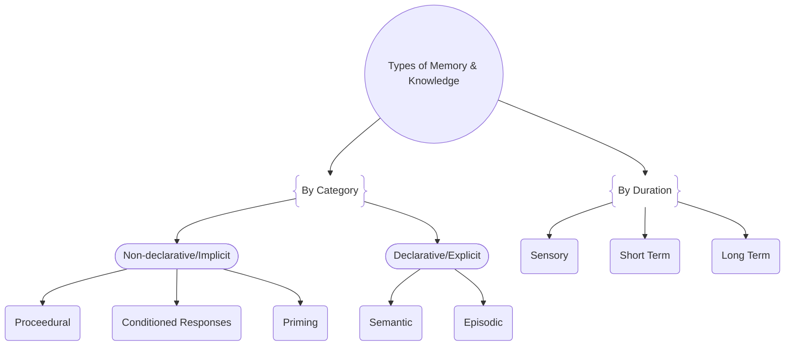

I've been recently learning about motor control and learning. This is my attempt to describe some key points and their importance for teaching or learning any type of movement.

## Useful Language

**Skills:**
- May be classified as: **Cognitive, Perceptual, or Motor.**
- Must be: **Repeatable and Learned** (not innate reflex).
- Skill level may be judged on:
    - **Certainty of goal achievement**
    - **Energy expenditure**
    - **Time required**
- May be evaluated along a variety of axes:
    - Open vs. Closed
    - Discrete, Serial, Continuous
    - Gross vs. Fine
    - Gentile's taxonomys

An inherent reflex (not learned) is not a motor skill. Additionally, while an individual may have declarative knowledge about a skill, this is seperate from the procedural knowlege of its execution. For those unfamiliar with with these categories, here is a simplified model of how the brain stores information:

